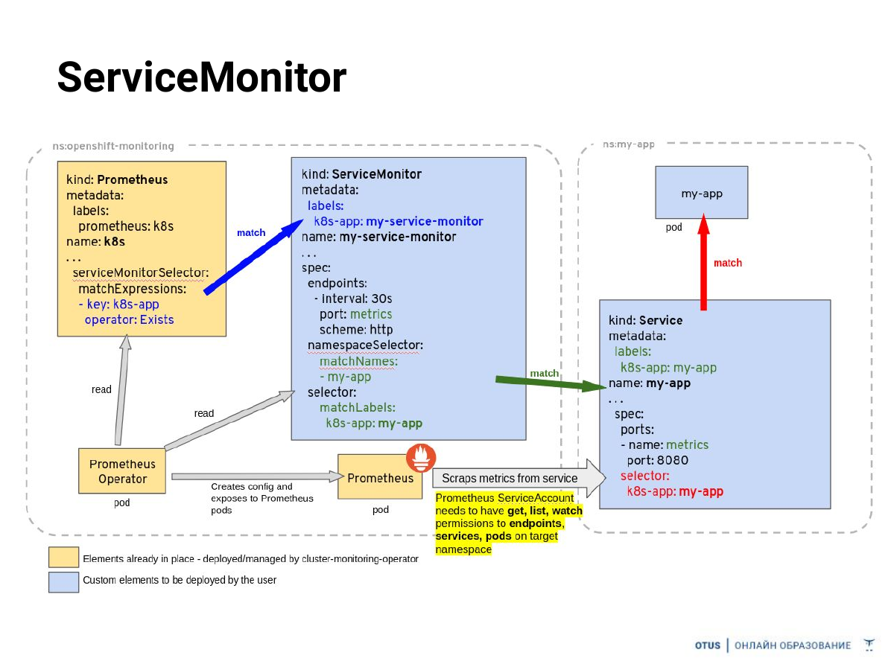

# 01. Мониторинг: Prometheus + Grafana

## Цель

Показать путь метрики от FastAPI до Grafana: сервис отдает `/metrics`, Kubernetes Service находится через `ServiceMonitor`, Prometheus собирает метрики, Grafana визуализирует HTTP, model и input-feature signals.

## Архитектура

```text
send_requests.py / drifter
          |
          v
   Titanic FastAPI
   /predict  /metrics
          |
       Service
          |
    ServiceMonitor
          |
      Prometheus
          |
       Grafana
```

## Слайд из лекции



## Что мониторим

HTTP:

- `starlette_requests_total` — status/path/method;
- специально невалидные запросы с `Pclass=4` дают HTTP 422.

Модель:

- `titanic_predictions_total` — распределение классов;
- `titanic_survival_probability` — histogram вероятностей;
- `titanic_correct_predictions_total` / `titanic_labeled_predictions_total` — online accuracy;
- `titanic_model_reloads_total` — reload model artifact после retrain.

Входные признаки:

- `titanic_input_age_years`;
- `titanic_input_fare`;
- `titanic_input_family_size`;
- `titanic_input_category_total`;
- `titanic_unknown_category_total`.

Модель использует `Pclass, Sex, Age, SibSp, Parch, Fare, Embarked` плюс derived `FamilySize, IsAlone, IsChild, FarePerPerson`.

Grafana dashboard provisioned автоматически из `infra/k8s/01_monitoring/grafana-dashboard.yaml`.

## Запуск

Monitoring stack ставится через Helm:

```bash
make infra
```

Затем:

```bash
make images
make apps
```

Port-forward:

```bash
kubectl -n mlops-demo port-forward svc/titanic-model 8000:8000
kubectl -n monitoring port-forward svc/monitoring-kube-prometheus-prometheus 9090:9090
kubectl -n monitoring port-forward svc/monitoring-grafana 3000:80
```

Отдельный traffic generator:

```bash
python -m pip install -r demos/01_monitoring/requirements.txt
python demos/01_monitoring/send_requests.py --count 100 --invalid-rate 0.10
```

Пароль Grafana:

```bash
kubectl -n monitoring get secret monitoring-grafana \
  -o jsonpath='{.data.admin-password}' | base64 --decode; echo
```

Полезные PromQL:

```promql
sum by (status_code) (rate(starlette_requests_total{job="titanic-model"}[1m]))
```

```promql
sum(rate(titanic_correct_predictions_total[2m]))
/
clamp_min(sum(rate(titanic_labeled_predictions_total[2m])), 0.001)
```
