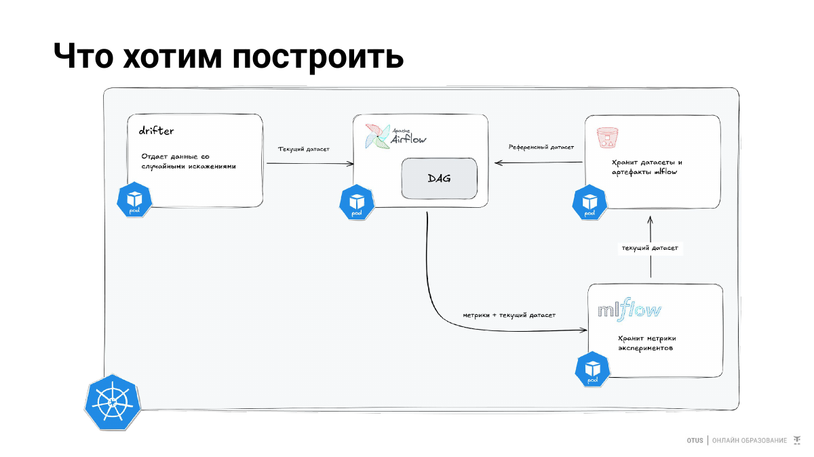

# 02. Поиск отклонений и data drift

## Цель

Реализовать на Titanic схему из drift-репозитория: Drifter формирует current population, Airflow регулярно запускает Evidently check, каждый check сохраняется в MLflow и одновременно отдает метрики в Prometheus.

## Архитектура

```text
Titanic reference CSV ----------------------+
                                             |
Drifter -> current Titanic CSV -> Evidently checker -> MLflow
                                      |
                                      +-> Prometheus
                                      ^
                                      |
                                   Airflow DAG
```

## Слайд из лекции



## Что именно дрифтует

Evidently проверяет все семь raw features модели:

```text
Pclass, Sex, Age, SibSp, Parch, Fare, Embarked
```

Drifter постепенно делает:

```text
Sex       -> часть значений получает *_drift
Embarked  -> часть значений получает *_drift
Pclass    -> растет доля 3 класса
Age       -> распределение сдвигается вверх
Fare      -> распределение сдвигается вверх
SibSp     -> небольшое увеличение
Parch     -> небольшое увеличение
```

Это специально контролируемый lecture drift. Target `Survived` остается исходным.

## Что делает Evidently checker

`POST /check`:

1. читает reference `data/titanic_train.csv`;
2. забирает current dataset у Drifter;
3. запускает `DataDriftPreset`;
4. экспортирует `titanic_drift_detected`, `titanic_drift_share` и `titanic_feature_drift_score{feature=...}`;
5. создает MLflow run;
6. логирует per-feature drift score;
7. сохраняет `current.csv`, `evidently.html`, `evidently.json`.

Airflow вызывает checker по `DRIFT_CHECK_CRON`.

## Запуск

```bash
make infra
make images
make apps
kubectl -n mlops-demo port-forward svc/mlflow 5000:5000
kubectl -n mlops-demo port-forward svc/airflow 8080:8080
kubectl -n mlops-demo port-forward svc/drift-checker 8002:8002
```

Ручной check:

```bash
curl -X POST http://127.0.0.1:8002/check
```

В MLflow откройте experiment `titanic-drift`. Каждый вызов `/check` — отдельный run.
