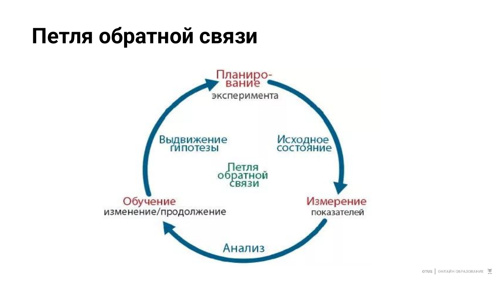
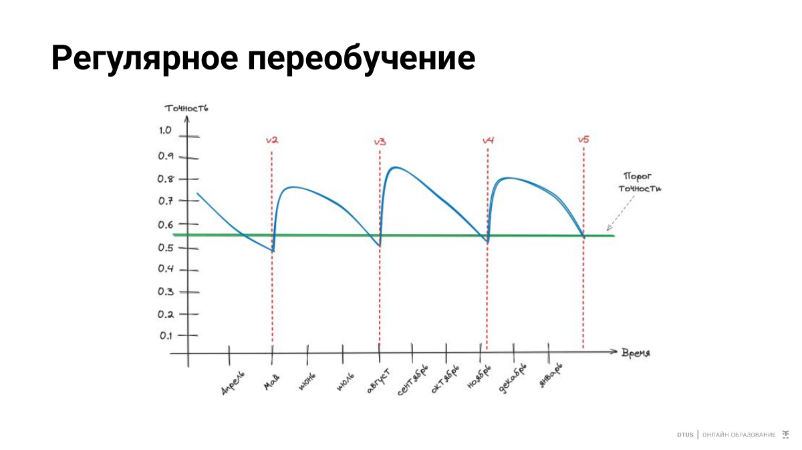

# 03. Обратная петля и автоматическое переобучение

## Цель

Показать полный feedback loop: drift ухудшает качество хорошей baseline-модели, Prometheus фиксирует падение accuracy, controller запускает retraining, новая модель обучается на current population и автоматически подхватывается inference service.

## Архитектура

```text
Drifter -> Titanic model -> Prometheus accuracy
              ^                    |
              |                    v
        shared model PVC <- MLflow Registry <- retrainer <- feedback controller
                                                    |
                                                    +-> MLflow run
```

## Слайд из лекции





## Baseline quality

Модель использует семь raw features и четыре простых derived features.

```text
baseline accuracy : 0.8545
baseline ROC-AUC  : 0.9061
```

Проверка:

```bash
make evaluate
```

## Как возникает деградация

При росте drift baseline постепенно ухудшается:

```text
drift=0.00 -> accuracy 0.8545
drift=0.20 -> accuracy 0.8284
drift=0.40 -> accuracy 0.7873
drift=0.50 -> accuracy 0.7687
drift=0.60 -> accuracy 0.7313
drift=0.95 -> accuracy 0.6940
```

Для feedback loop target передается вместе с запросом как `actual_survived`, поэтому online accuracy доступна сразу. В production target обычно приходит позже.

Controller раз в `CHECK_INTERVAL_SECONDS` спрашивает Prometheus:

```promql
sum(rate(titanic_correct_predictions_total[2m]))
/
clamp_min(sum(rate(titanic_labeled_predictions_total[2m])), 0.001)
```

При двух последовательных значениях ниже `ACCURACY_THRESHOLD=0.78` вызывается `POST /retrain`.

Retrainer:

1. забирает current drifted dataset;
2. делает stratified train/test split;
3. обучает тот же sklearn pipeline;
4. считает validation accuracy и ROC-AUC;
5. сохраняет training dataset в MinIO `current/` и пишет его URI в MLflow run;
6. пишет metrics + sklearn model artifact в MLflow experiment `titanic-retraining` (artifact destination — MinIO `model-artifacts/`);
7. создает новую версию registered model `titanic-survival-model` в MLflow и переводит ее в `Staging`;
8. проверяет quality gate, затем переводит версию в `Production`;
9. скачивает именно Production-версию из MLflow Registry и атомарно заменяет `/models/model.joblib` на общем PVC.

Model service замечает изменение `mtime` и reload-ит artifact без redeploy.

## MLflow Registry: promotion и rollback

Каждый retrain создает MLflow run и новую версию `titanic-survival-model`. До deployment она находится в `Staging` и получает tags с результатом quality gate. По умолчанию включен автоматический promotion, только если одновременно выполнены:

```text
validation accuracy >= 0.80
validation ROC-AUC  >= 0.85
```

После успешного gate новая версия становится `Production`, предыдущая Production-версия архивируется, а serving service получает артефакт именно из Registry. Порог и режим approval задаются в `demo-config.yaml`:

```yaml
MODEL_REGISTRY_NAME: "titanic-survival-model"
AUTO_PROMOTE_MODEL: "true"
PROMOTION_MIN_ACCURACY: "0.80"
PROMOTION_MIN_ROC_AUC: "0.85"
```

Для ручного approval установите `AUTO_PROMOTE_MODEL: "false"`, примените ConfigMap и перезапустите retrainer. Затем выберите version в MLflow UI или вызовите API:

```bash
curl -X POST http://127.0.0.1:8004/approve/<VERSION>
```

Rollback не требует повторного обучения: он возвращает выбранную зарегистрированную версию в `Production` и записывает ее artifact в shared PVC:

```bash
curl -X POST http://127.0.0.1:8004/rollback/<VERSION>
```

Registry lifecycle отдается в Prometheus через `titanic_active_model_version` и `titanic_model_registry_events_total`.

На контрольной симуляции при `drift=0.95`:

```text
old model accuracy : 0.6940
new model accuracy : 0.8470
new model ROC-AUC  : 0.8919
```

## Главные настройки

`infra/k8s/common/demo-config.yaml`:

```yaml
REQUEST_INTERVAL_SECONDS: "1"
DRIFT_STEP_PER_REQUEST: "0.002"
DRIFT_MAX: "0.95"
CHECK_INTERVAL_SECONDS: "15"
ACCURACY_THRESHOLD: "0.78"
BAD_CHECKS_BEFORE_RETRAIN: "2"
RETRAIN_COOLDOWN_SECONDS: "120"
RETRAIN_ROWS: "800"
```

Для быстрого live-demo можно увеличить `DRIFT_STEP_PER_REQUEST` до `0.01`.

## Запуск

```bash
make infra
make images
make apps
make ports
```

На Grafana dashboard смотрите `Accuracy`, `Drift strength`, `Feature drift score`, `Retrain validation quality` и `Model reload / retrain`.
