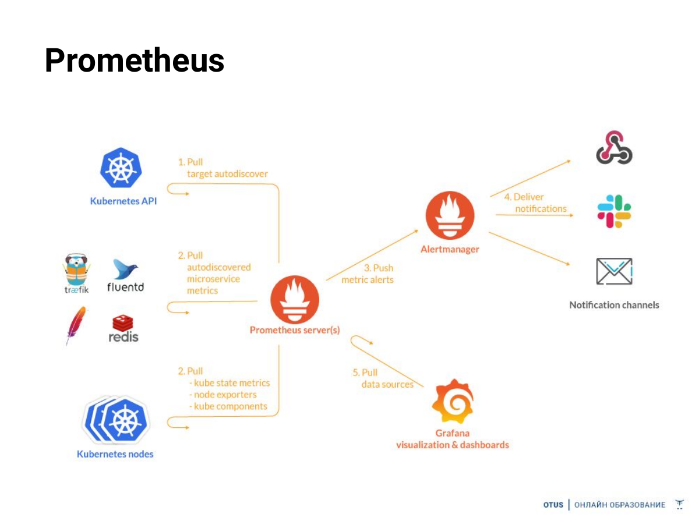
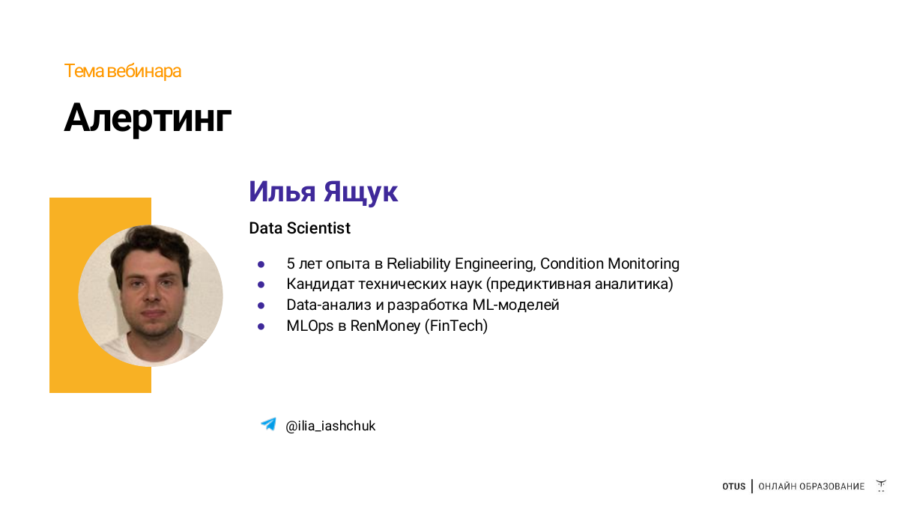

# 04. Alerting: Prometheus, Grafana и Telegram

## Цель

Показать два пути alerting: `PrometheusRule -> Alertmanager -> Telegram` и `Grafana Alert Rule -> Telegram Contact Point`.

## Архитектура

```text
Prometheus metrics -> PrometheusRule -> Alertmanager -> Telegram
        |
        +-> Grafana query -> Grafana Alert Rule -> Telegram Contact Point
```

## Слайд из лекции

В отдельном PDF «Алертинг» есть только титульный слайд, поэтому для архитектуры использован слайд из лекции Prometheus: Prometheus передает alerts в Alertmanager, Grafana читает данные из Prometheus.



Титульный слайд:



## Запуск: Prometheus -> Alertmanager -> Telegram

1. Создайте bot через `@BotFather`.
2. Добавьте bot в группу/канал и разрешите отправку сообщений.
3. После добавления bot отправьте сообщение в группу/канал и получите `chat_id`:

```bash
export BOT_TOKEN='<BOT_TOKEN>'
curl "https://api.telegram.org/bot${BOT_TOKEN}/getUpdates"
```

Для группы смотрите `message.chat.id`, для канала — `channel_post.chat.id`.

4. Создайте локальный values-файл:

```bash
cp infra/helm/telegram-values.example.yaml infra/helm/telegram-values.yaml
```

5. В `infra/helm/telegram-values.yaml` замените:

```yaml
bot_token: "<BOT_TOKEN>"
chat_id: -1001234567890
```

6. Переустановите/обновите monitoring stack:

```bash
make infra
kubectl apply -f infra/k8s/04_alerting/prometheus-rules.yaml
```

`make infra` автоматически подхватывает `infra/helm/telegram-values.yaml`, если файл существует. В Telegram маршрутизируются только alerts с именами `Titanic*`, поэтому системные alerts самого `kube-prometheus-stack` не засоряют учебный канал.

В проекте четыре правила:

- сервис недоступен;
- HTTP errors > 5%;
- accuracy < 0.78;
- Evidently обнаружил drift.

Проверка:

```bash
make ports
```

Откройте Prometheus -> Alerts. Для быстрого теста:

```bash
kubectl -n mlops-demo scale deployment/titanic-model --replicas=0
```

Правило использует и `up == 0`, и `absent(up{job="titanic-model"})`, поэтому оно срабатывает и когда target перестал отвечать, и когда после scale-to-zero target вообще исчез из discovery.

Вернуть сервис:

```bash
kubectl -n mlops-demo scale deployment/titanic-model --replicas=1
```

`infra/helm/telegram-values.yaml` находится в `.gitignore`. Не коммитьте реальный bot token.

## Grafana Alerting -> Telegram

1. Откройте Grafana `localhost:3000`.
2. `Alerting -> Contact points -> Add contact point`.
3. Integration: `Telegram`.
4. Укажите bot token и chat ID, нажмите `Test`.
5. `Alerting -> Alert rules -> New alert rule`.
6. Data source: Prometheus.
7. Возьмите query accuracy из `README_03_FEEDBACK_LOOP.md` и поставьте condition `< 0.78`.
8. В Notification policy направьте rule на созданный Telegram contact point.

На лекции видно различие: `PrometheusRule` исполняется Prometheus/Alertmanager, а Grafana rule — Grafana.
